# Quick Survey App - Process Flow and Architecture Diagrams

## Application Architecture Overview

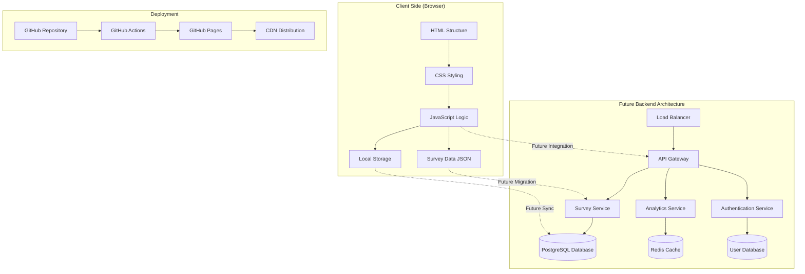

## Current Application Flow

### User Journey Flow
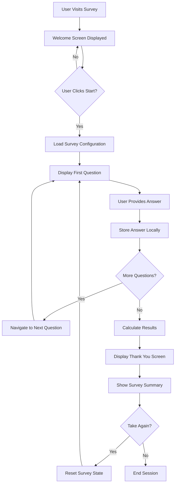

### Question Type Handling Flow
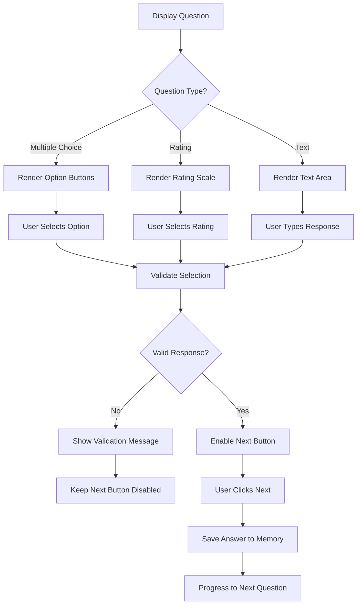

### Navigation Flow
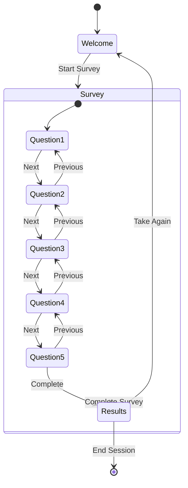

## Data Flow Architecture

### Current Data Flow
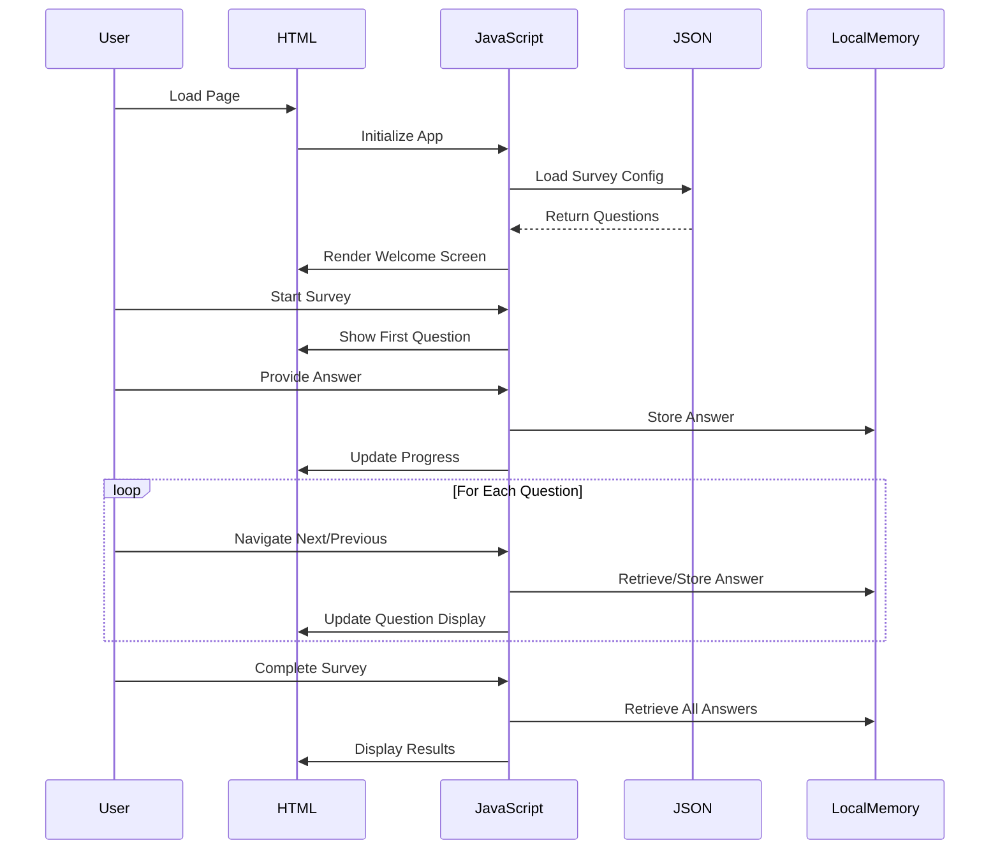

### Future Backend Integration Flow
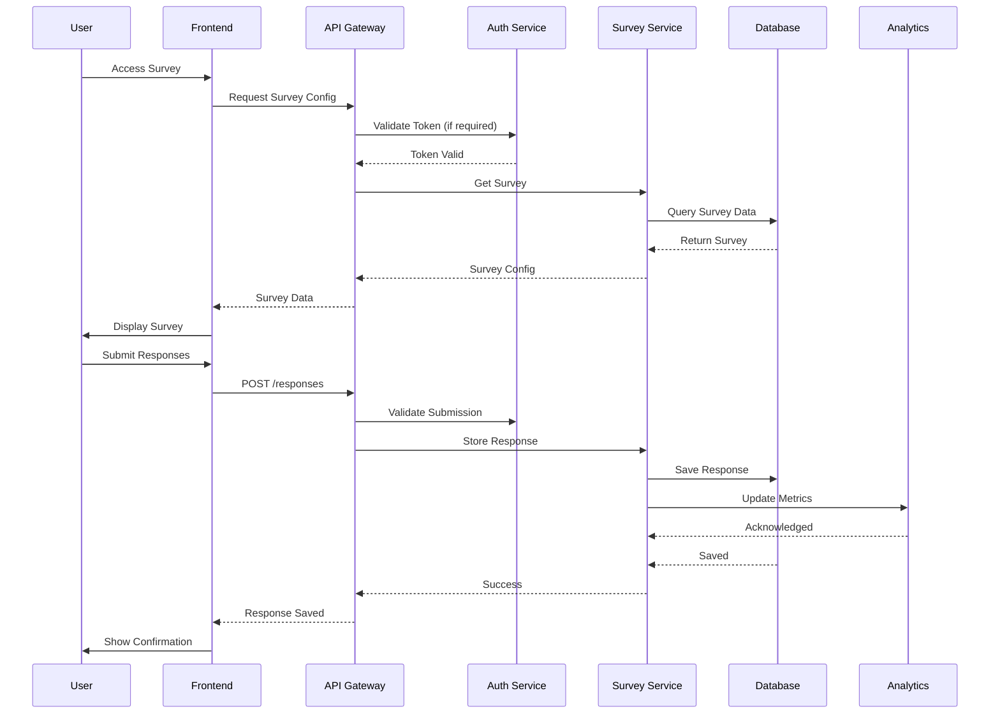

## Component Architecture

### Frontend Component Structure
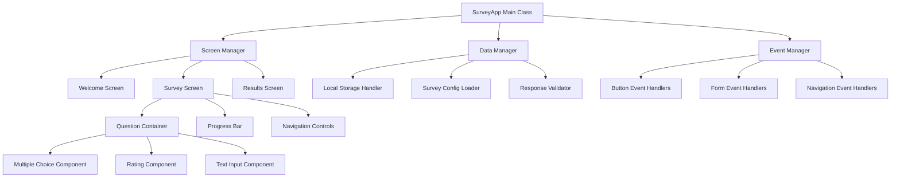

### Future Microservices Architecture
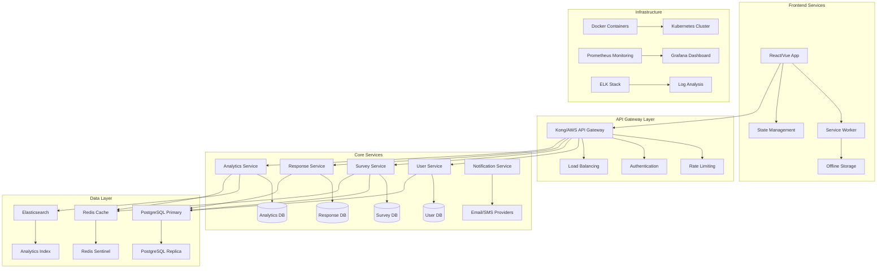

## Deployment Architecture

### Current GitHub Pages Deployment
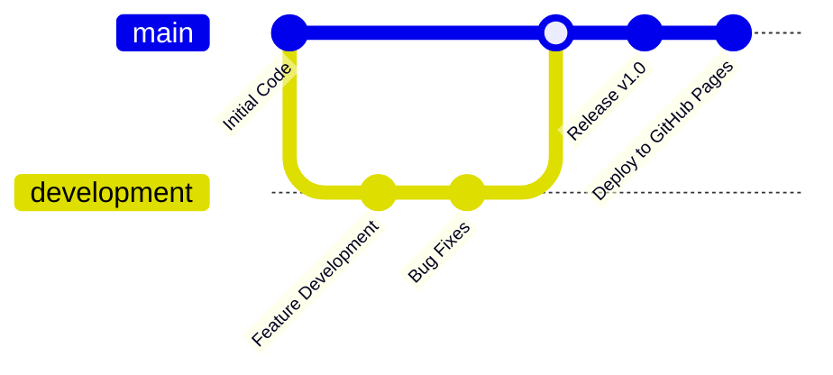

### GitHub Actions Workflow
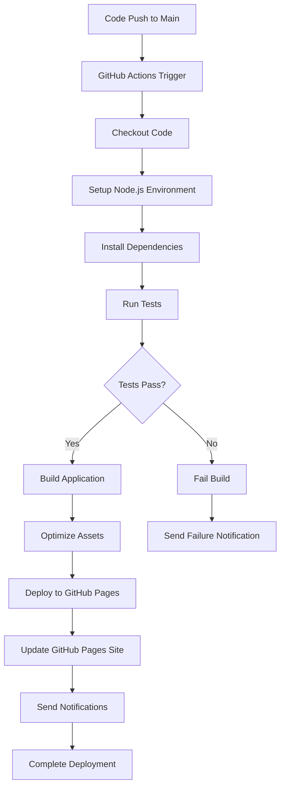

### Future Production Deployment
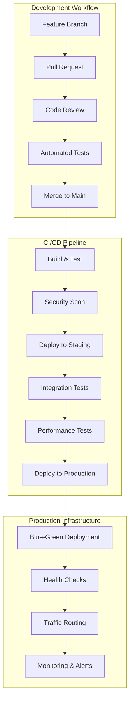

## Security Architecture

### Authentication Flow
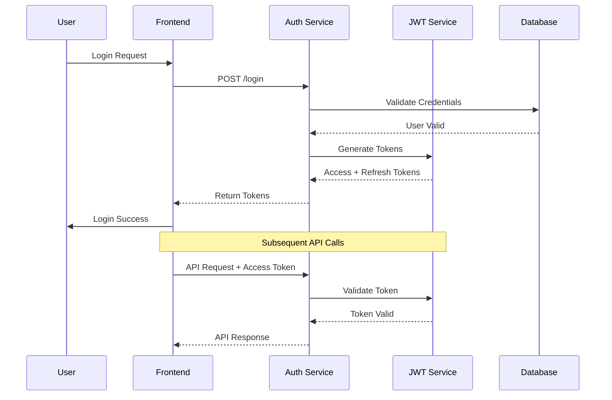

### Data Security Flow
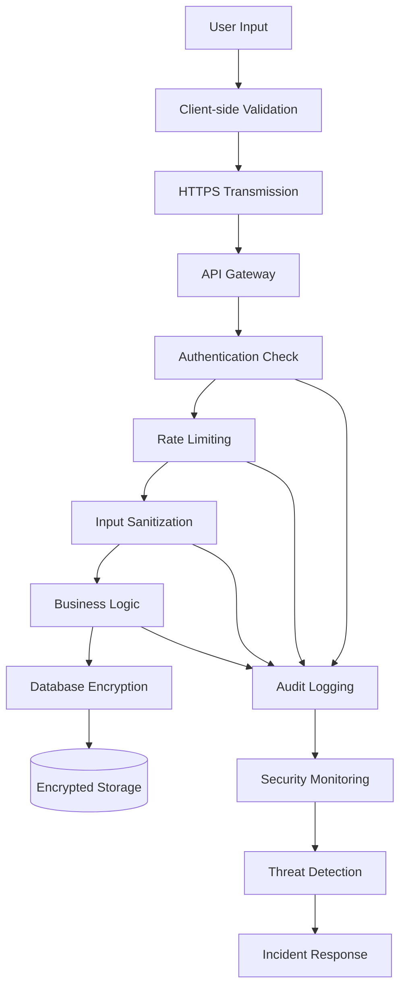

## Performance Architecture

### Caching Strategy
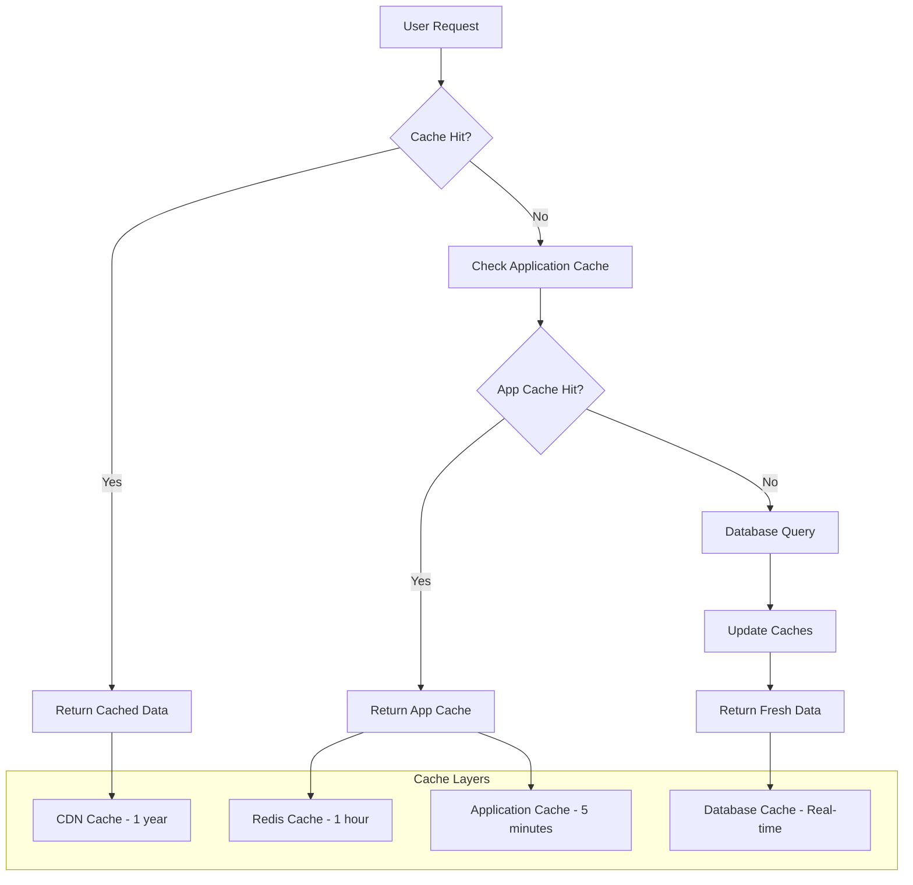

### Load Balancing Architecture
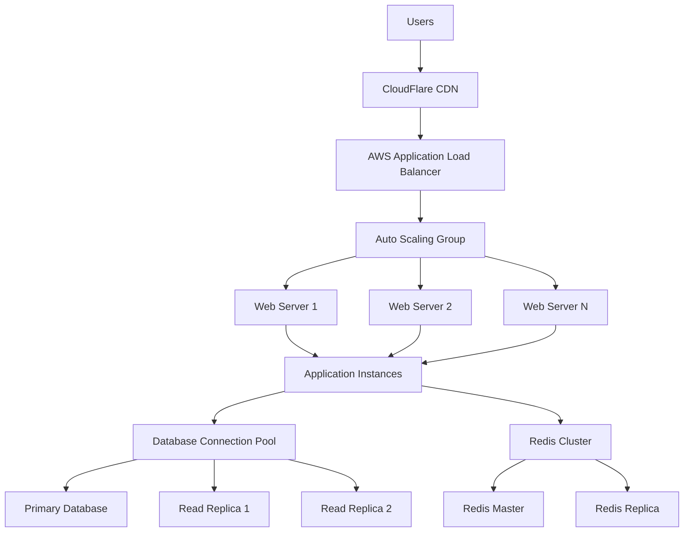

## Monitoring and Analytics

### Application Monitoring Flow
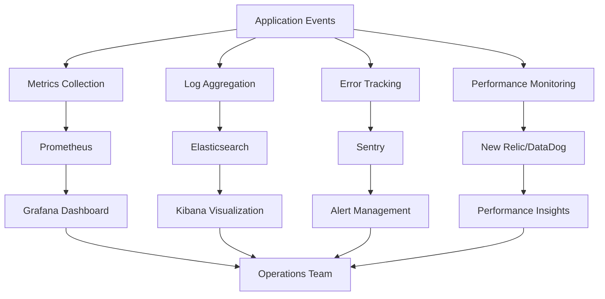

### User Analytics Flow
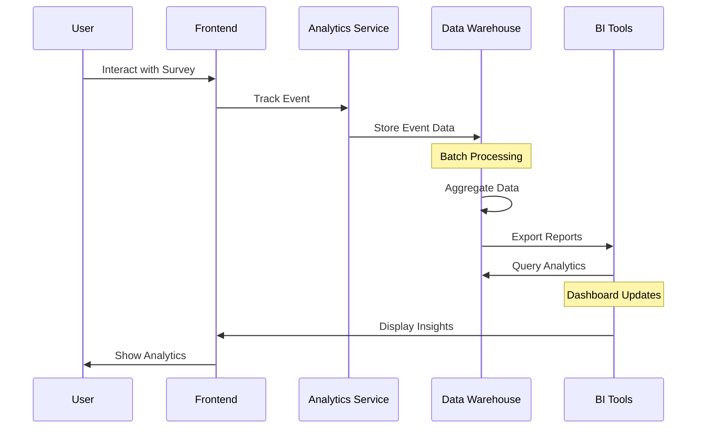

These diagrams provide a comprehensive view of the Quick Survey App's architecture, from the current simple client-side implementation to the future scalable, enterprise-ready system. Each diagram illustrates different aspects of the system's design, helping developers, stakeholders, and users understand the application's structure and evolution path.