# Categories Feature - Architecture and Process Flow Diagrams

## System Architecture

### High-Level Architecture

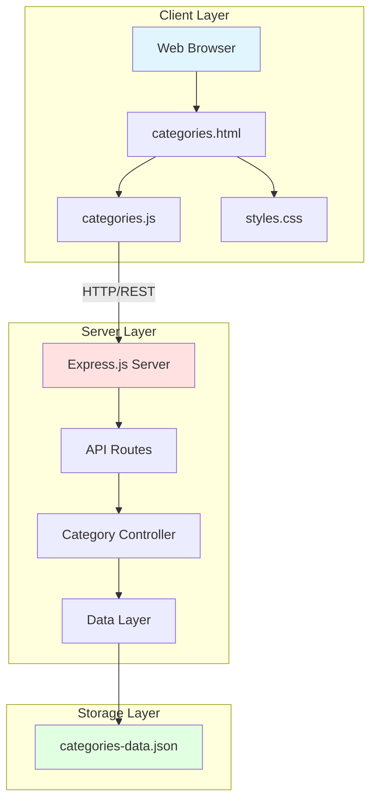
```mermaid
graph TB
    subgraph "Client Layer"
        A[Web Browser] --> B[categories.html]
        B --> C[categories.js]
        B --> D[styles.css]
    end
    
    subgraph "Server Layer"
        E[Express.js Server] --> F[API Routes]
        F --> G[Category Controller]
        G --> H[Data Layer]
    end
    
    subgraph "Storage Layer"
        H --> I[categories-data.json]
    end
    
    C -->|HTTP/REST| E
    
    style A fill:#e1f5ff
    style E fill:#ffe1e1
    style I fill:#e1ffe1
```

### Component Architecture

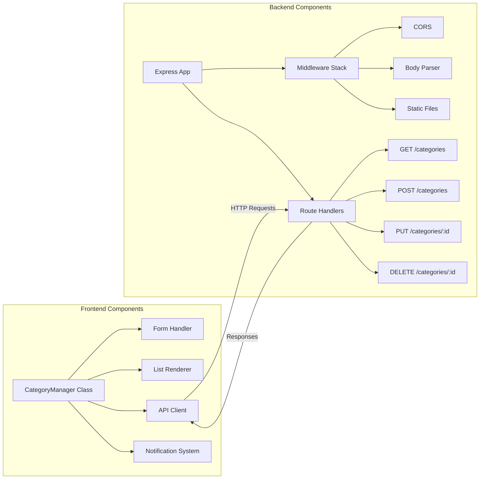
```mermaid
graph LR
    subgraph "Frontend Components"
        A[CategoryManager Class] --> B[Form Handler]
        A --> C[List Renderer]
        A --> D[API Client]
        A --> E[Notification System]
    end
    
    subgraph "Backend Components"
        F[Express App] --> G[Middleware Stack]
        G --> H[CORS]
        G --> I[Body Parser]
        G --> J[Static Files]
        F --> K[Route Handlers]
        K --> L[GET /categories]
        K --> M[POST /categories]
        K --> N[PUT /categories/:id]
        K --> O[DELETE /categories/:id]
    end
    
    D -->|HTTP Requests| K
    K -->|Responses| D
```

### Data Flow Architecture

```mermaid
flowchart LR
    A[User Input] --> B[Frontend Validation]
    B --> C[API Request]
    C --> D[Server Validation]
    D --> E[Business Logic]
    E --> F[Data Persistence]
    F --> G[categories-data.json]
    G --> H[Response]
    H --> I[UI Update]
    I --> J[User Feedback]
    
    style A fill:#e3f2fd
    style G fill:#f3e5f5
    style J fill:#e8f5e9
```

## Process Flows

### User Journey: Category Management

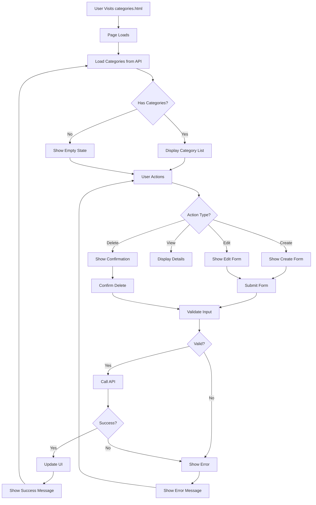
```mermaid
flowchart TD
    A[User Visits categories.html] --> B[Page Loads]
    B --> C[Load Categories from API]
    C --> D{Has Categories?}
    D -->|Yes| E[Display Category List]
    D -->|No| F[Show Empty State]
    
    E --> G[User Actions]
    F --> G
    
    G --> H{Action Type?}
    H -->|Create| I[Show Create Form]
    H -->|Edit| J[Show Edit Form]
    H -->|Delete| K[Show Confirmation]
    H -->|View| L[Display Details]
    
    I --> M[Submit Form]
    J --> M
    K --> N[Confirm Delete]
    
    M --> O[Validate Input]
    N --> O
    
    O --> P{Valid?}
    P -->|Yes| Q[Call API]
    P -->|No| R[Show Error]
    
    Q --> S{Success?}
    S -->|Yes| T[Update UI]
    S -->|No| R
    
    T --> U[Show Success Message]
    R --> V[Show Error Message]
    
    U --> C
    V --> G
```

### CRUD Operations Flow

#### Create Category Flow

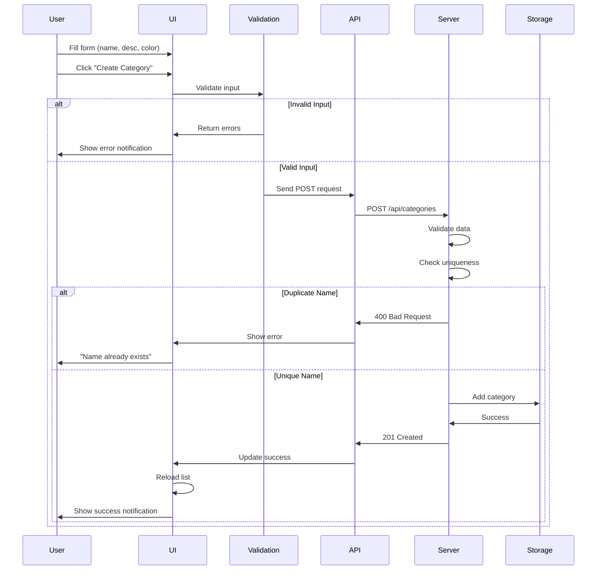
```mermaid
sequenceDiagram
    participant User
    participant UI
    participant Validation
    participant API
    participant Server
    participant Storage
    
    User->>UI: Fill form (name, desc, color)
    User->>UI: Click "Create Category"
    UI->>Validation: Validate input
    
    alt Invalid Input
        Validation->>UI: Return errors
        UI->>User: Show error notification
    else Valid Input
        Validation->>API: Send POST request
        API->>Server: POST /api/categories
        Server->>Server: Validate data
        Server->>Server: Check uniqueness
        
        alt Duplicate Name
            Server->>API: 400 Bad Request
            API->>UI: Show error
            UI->>User: "Name already exists"
        else Unique Name
            Server->>Storage: Add category
            Storage->>Server: Success
            Server->>API: 201 Created
            API->>UI: Update success
            UI->>UI: Reload list
            UI->>User: Show success notification
        end
    end
```

#### Read Categories Flow

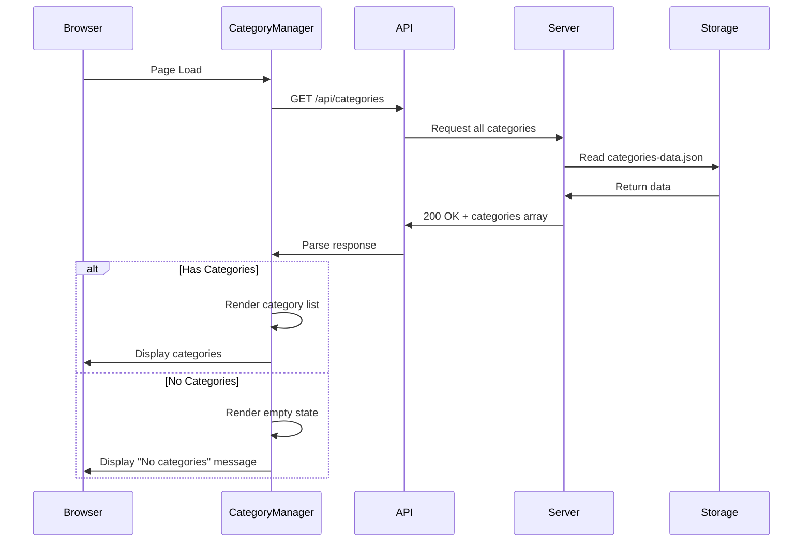
```mermaid
sequenceDiagram
    participant Browser
    participant CategoryManager
    participant API
    participant Server
    participant Storage
    
    Browser->>CategoryManager: Page Load
    CategoryManager->>API: GET /api/categories
    API->>Server: Request all categories
    Server->>Storage: Read categories-data.json
    Storage->>Server: Return data
    Server->>API: 200 OK + categories array
    API->>CategoryManager: Parse response
    
    alt Has Categories
        CategoryManager->>CategoryManager: Render category list
        CategoryManager->>Browser: Display categories
    else No Categories
        CategoryManager->>CategoryManager: Render empty state
        CategoryManager->>Browser: Display "No categories" message
    end
```

#### Update Category Flow

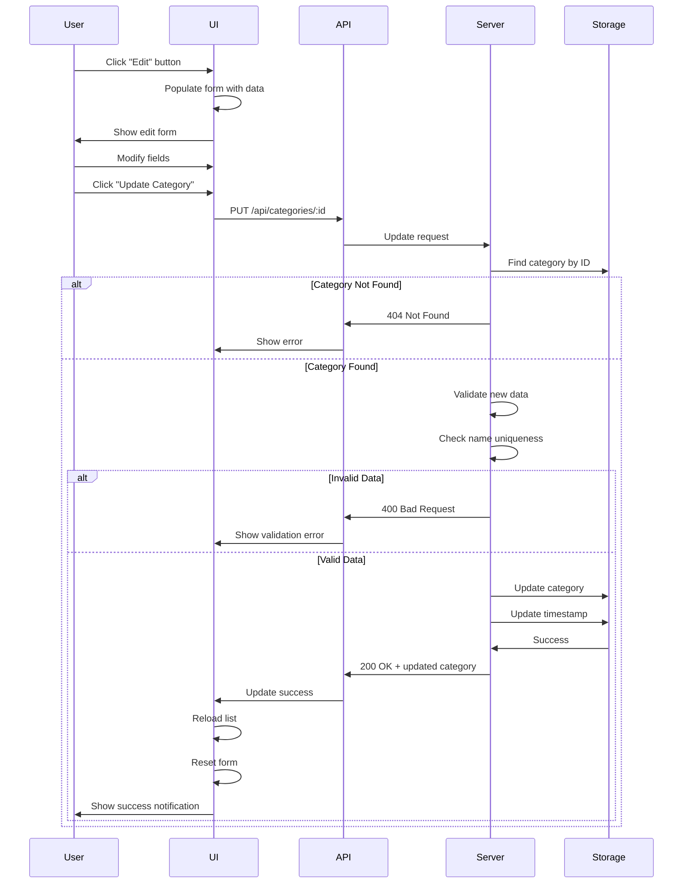
```mermaid
sequenceDiagram
    participant User
    participant UI
    participant API
    participant Server
    participant Storage
    
    User->>UI: Click "Edit" button
    UI->>UI: Populate form with data
    UI->>User: Show edit form
    
    User->>UI: Modify fields
    User->>UI: Click "Update Category"
    
    UI->>API: PUT /api/categories/:id
    API->>Server: Update request
    
    Server->>Storage: Find category by ID
    
    alt Category Not Found
        Server->>API: 404 Not Found
        API->>UI: Show error
    else Category Found
        Server->>Server: Validate new data
        Server->>Server: Check name uniqueness
        
        alt Invalid Data
            Server->>API: 400 Bad Request
            API->>UI: Show validation error
        else Valid Data
            Server->>Storage: Update category
            Server->>Storage: Update timestamp
            Storage->>Server: Success
            Server->>API: 200 OK + updated category
            API->>UI: Update success
            UI->>UI: Reload list
            UI->>UI: Reset form
            UI->>User: Show success notification
        end
    end
```

#### Delete Category Flow

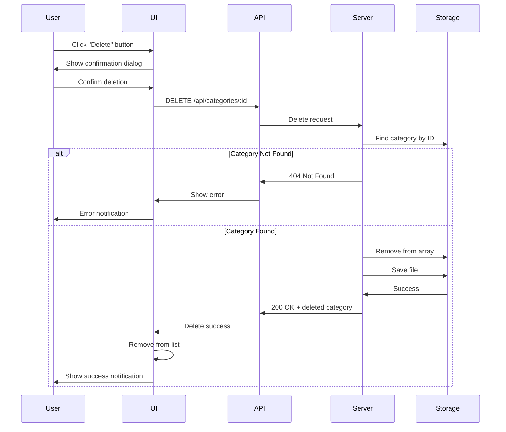
```mermaid
sequenceDiagram
    participant User
    participant UI
    participant API
    participant Server
    participant Storage
    
    User->>UI: Click "Delete" button
    UI->>User: Show confirmation dialog
    
    User->>UI: Confirm deletion
    
    UI->>API: DELETE /api/categories/:id
    API->>Server: Delete request
    
    Server->>Storage: Find category by ID
    
    alt Category Not Found
        Server->>API: 404 Not Found
        API->>UI: Show error
        UI->>User: Error notification
    else Category Found
        Server->>Storage: Remove from array
        Server->>Storage: Save file
        Storage->>Server: Success
        Server->>API: 200 OK + deleted category
        API->>UI: Delete success
        UI->>UI: Remove from list
        UI->>User: Show success notification
    end
```

## State Management

### Frontend State Machine

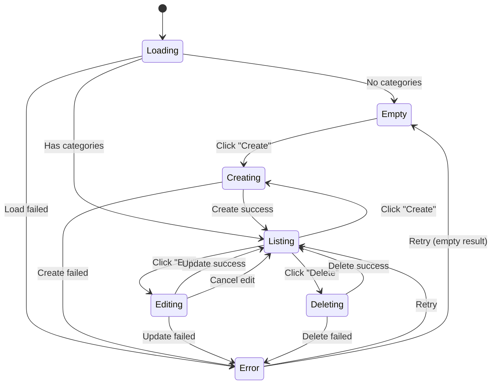
```mermaid
stateDiagram-v2
    [*] --> Loading
    Loading --> Empty: No categories
    Loading --> Listing: Has categories
    Loading --> Error: Load failed
    
    Empty --> Creating: Click "Create"
    Listing --> Creating: Click "Create"
    Listing --> Editing: Click "Edit"
    Listing --> Deleting: Click "Delete"
    
    Creating --> Listing: Create success
    Creating --> Error: Create failed
    
    Editing --> Listing: Update success
    Editing --> Listing: Cancel edit
    Editing --> Error: Update failed
    
    Deleting --> Listing: Delete success
    Deleting --> Error: Delete failed
    
    Error --> Listing: Retry
    Error --> Empty: Retry (empty result)
```

### API Request States

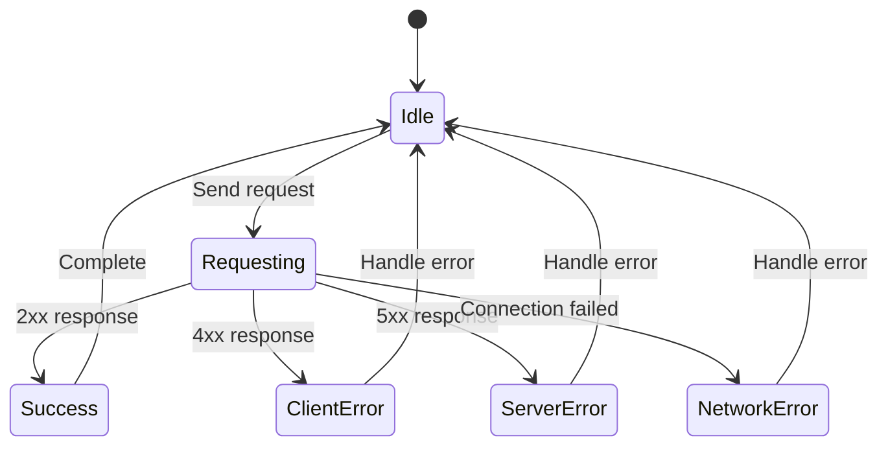
```mermaid
stateDiagram-v2
    [*] --> Idle
    Idle --> Requesting: Send request
    Requesting --> Success: 2xx response
    Requesting --> ClientError: 4xx response
    Requesting --> ServerError: 5xx response
    Requesting --> NetworkError: Connection failed
    
    Success --> Idle: Complete
    ClientError --> Idle: Handle error
    ServerError --> Idle: Handle error
    NetworkError --> Idle: Handle error
```

## Data Model

### Category Entity Model

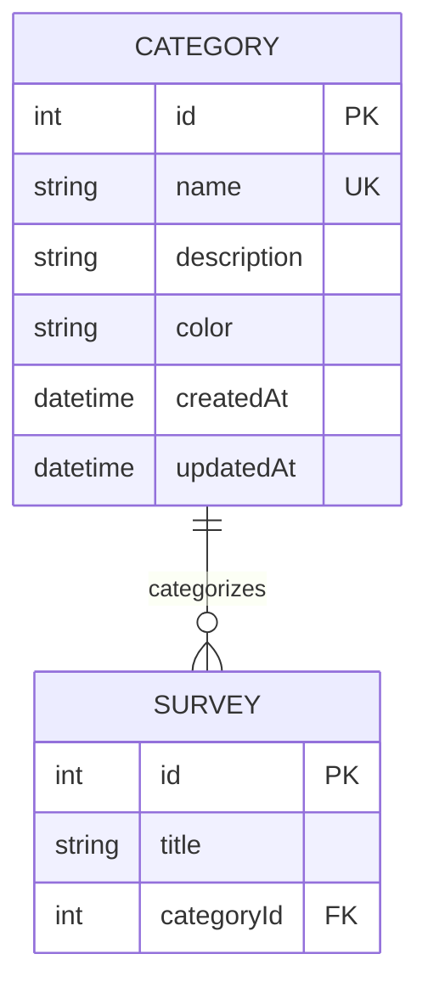
```mermaid
erDiagram
    CATEGORY {
        int id PK
        string name UK
        string description
        string color
        datetime createdAt
        datetime updatedAt
    }
    
    CATEGORY ||--o{ SURVEY : categorizes
    
    SURVEY {
        int id PK
        string title
        int categoryId FK
    }
```

### File Storage Structure

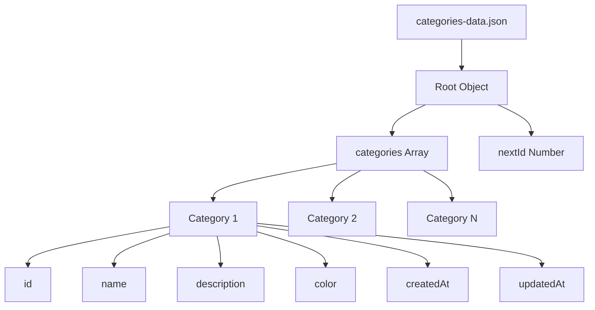
```mermaid
graph TD
    A[categories-data.json] --> B[Root Object]
    B --> C[categories Array]
    B --> D[nextId Number]
    
    C --> E[Category 1]
    C --> F[Category 2]
    C --> G[Category N]
    
    E --> H[id]
    E --> I[name]
    E --> J[description]
    E --> K[color]
    E --> L[createdAt]
    E --> M[updatedAt]
```

## Error Handling Flow

### Error Propagation

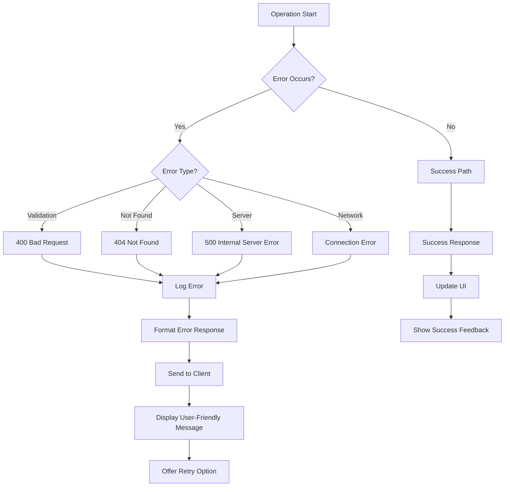
```mermaid
flowchart TD
    A[Operation Start] --> B{Error Occurs?}
    B -->|No| C[Success Path]
    B -->|Yes| D{Error Type?}
    
    D -->|Validation| E[400 Bad Request]
    D -->|Not Found| F[404 Not Found]
    D -->|Server| G[500 Internal Server Error]
    D -->|Network| H[Connection Error]
    
    E --> I[Log Error]
    F --> I
    G --> I
    H --> I
    
    I --> J[Format Error Response]
    J --> K[Send to Client]
    K --> L[Display User-Friendly Message]
    L --> M[Offer Retry Option]
    
    C --> N[Success Response]
    N --> O[Update UI]
    O --> P[Show Success Feedback]
```

## API Request/Response Flow

### Complete API Lifecycle

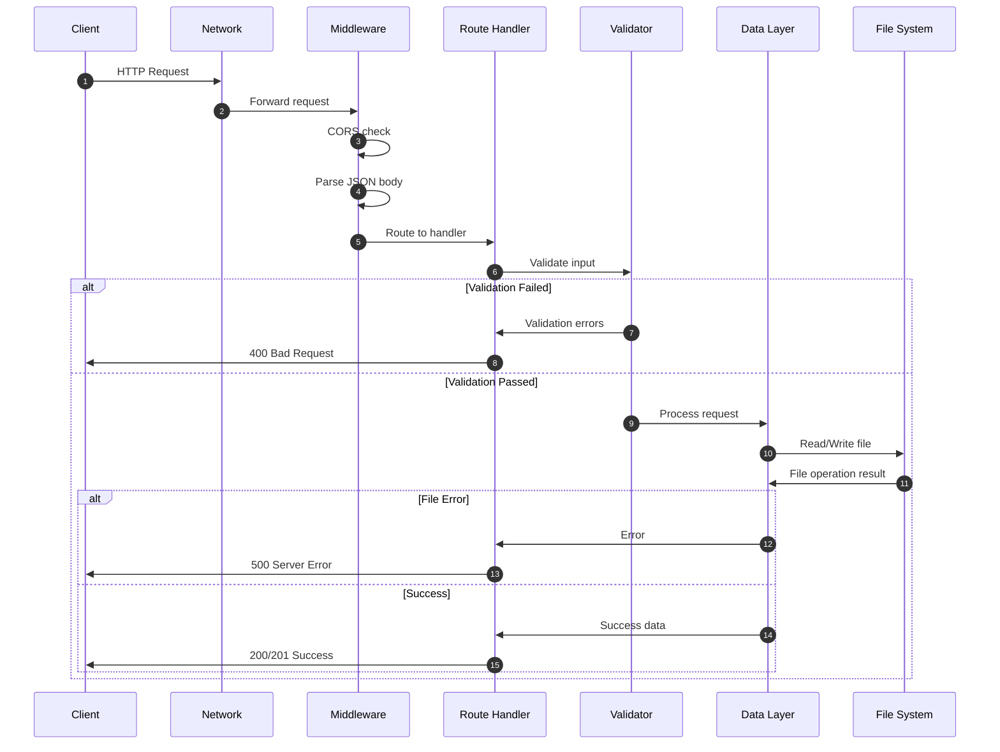
```mermaid
sequenceDiagram
    autonumber
    participant C as Client
    participant N as Network
    participant M as Middleware
    participant R as Route Handler
    participant V as Validator
    participant D as Data Layer
    participant F as File System
    
    C->>N: HTTP Request
    N->>M: Forward request
    M->>M: CORS check
    M->>M: Parse JSON body
    M->>R: Route to handler
    R->>V: Validate input
    
    alt Validation Failed
        V->>R: Validation errors
        R->>C: 400 Bad Request
    else Validation Passed
        V->>D: Process request
        D->>F: Read/Write file
        F->>D: File operation result
        
        alt File Error
            D->>R: Error
            R->>C: 500 Server Error
        else Success
            D->>R: Success data
            R->>C: 200/201 Success
        end
    end
```

## Deployment Architecture

### Current Deployment

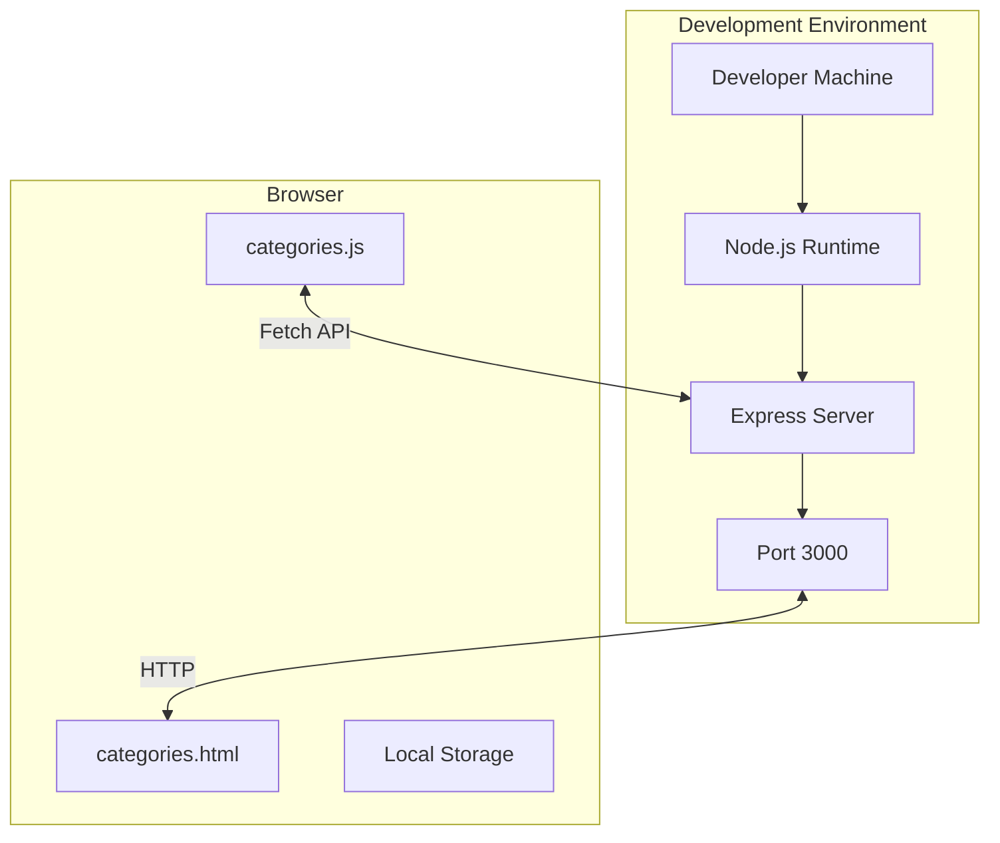
```mermaid
graph TB
    subgraph "Development Environment"
        A[Developer Machine] --> B[Node.js Runtime]
        B --> C[Express Server]
        C --> D[Port 3000]
    end
    
    subgraph "Browser"
        E[categories.html]
        F[categories.js]
        G[Local Storage]
    end
    
    D <-->|HTTP| E
    F <-->|Fetch API| C
```

### Future Production Architecture

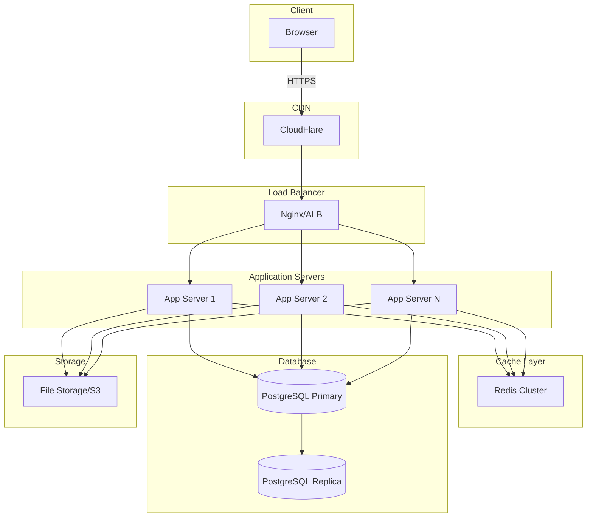
```mermaid
graph TB
    subgraph "Client"
        A[Browser]
    end
    
    subgraph "CDN"
        B[CloudFlare]
    end
    
    subgraph "Load Balancer"
        C[Nginx/ALB]
    end
    
    subgraph "Application Servers"
        D[App Server 1]
        E[App Server 2]
        F[App Server N]
    end
    
    subgraph "Cache Layer"
        G[Redis Cluster]
    end
    
    subgraph "Database"
        H[(PostgreSQL Primary)]
        I[(PostgreSQL Replica)]
    end
    
    subgraph "Storage"
        J[File Storage/S3]
    end
    
    A -->|HTTPS| B
    B --> C
    C --> D
    C --> E
    C --> F
    
    D --> G
    E --> G
    F --> G
    
    D --> H
    E --> H
    F --> H
    
    H --> I
    
    D --> J
    E --> J
    F --> J
```

## CI/CD Pipeline

### Deployment Workflow

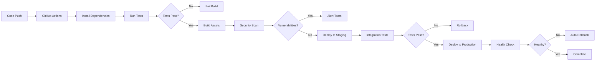
```mermaid
flowchart LR
    A[Code Push] --> B[GitHub Actions]
    B --> C[Install Dependencies]
    C --> D[Run Tests]
    D --> E{Tests Pass?}
    
    E -->|No| F[Fail Build]
    E -->|Yes| G[Build Assets]
    
    G --> H[Security Scan]
    H --> I{Vulnerabilities?}
    
    I -->|Yes| J[Alert Team]
    I -->|No| K[Deploy to Staging]
    
    K --> L[Integration Tests]
    L --> M{Tests Pass?}
    
    M -->|No| N[Rollback]
    M -->|Yes| O[Deploy to Production]
    
    O --> P[Health Check]
    P --> Q{Healthy?}
    
    Q -->|No| R[Auto Rollback]
    Q -->|Yes| S[Complete]
```

## Monitoring and Observability

### Monitoring Architecture

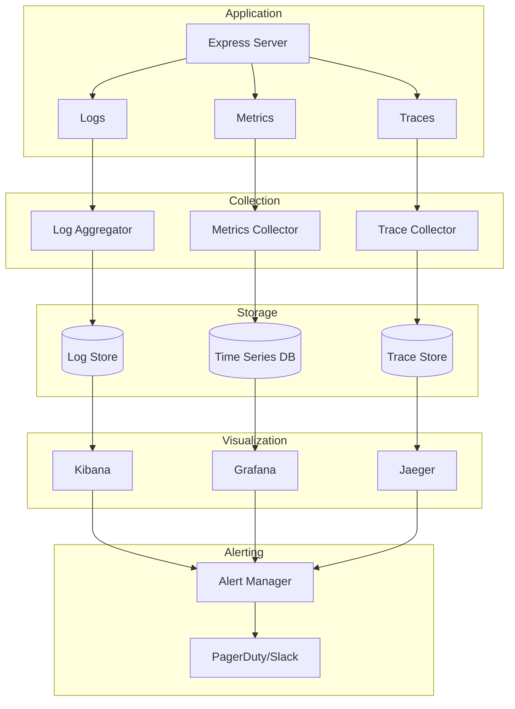
```mermaid
graph TB
    subgraph "Application"
        A[Express Server] --> B[Logs]
        A --> C[Metrics]
        A --> D[Traces]
    end
    
    subgraph "Collection"
        B --> E[Log Aggregator]
        C --> F[Metrics Collector]
        D --> G[Trace Collector]
    end
    
    subgraph "Storage"
        E --> H[(Log Store)]
        F --> I[(Time Series DB)]
        G --> J[(Trace Store)]
    end
    
    subgraph "Visualization"
        H --> K[Kibana]
        I --> L[Grafana]
        J --> M[Jaeger]
    end
    
    subgraph "Alerting"
        K --> N[Alert Manager]
        L --> N
        M --> N
        N --> O[PagerDuty/Slack]
    end
```

## Security Architecture

### Authentication Flow (Future)

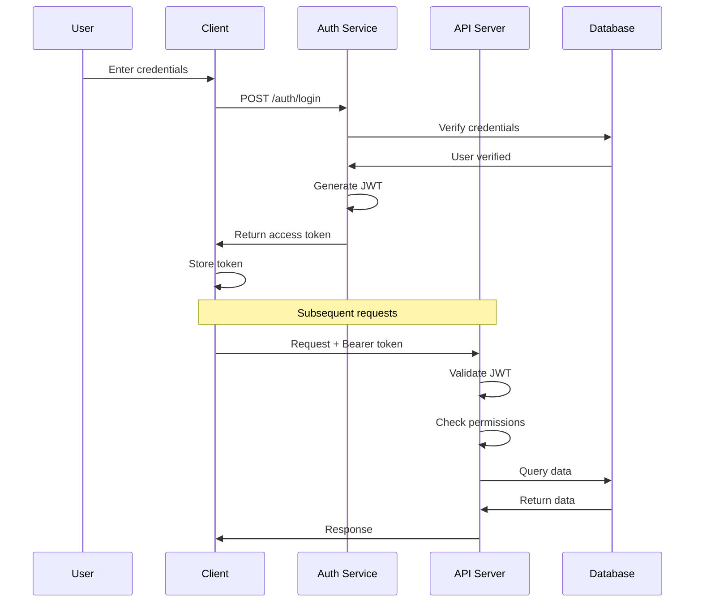
```mermaid
sequenceDiagram
    participant U as User
    participant C as Client
    participant A as Auth Service
    participant API as API Server
    participant DB as Database
    
    U->>C: Enter credentials
    C->>A: POST /auth/login
    A->>DB: Verify credentials
    DB->>A: User verified
    A->>A: Generate JWT
    A->>C: Return access token
    C->>C: Store token
    
    Note over C,API: Subsequent requests
    
    C->>API: Request + Bearer token
    API->>API: Validate JWT
    API->>API: Check permissions
    API->>DB: Query data
    DB->>API: Return data
    API->>C: Response
```

### Authorization Matrix

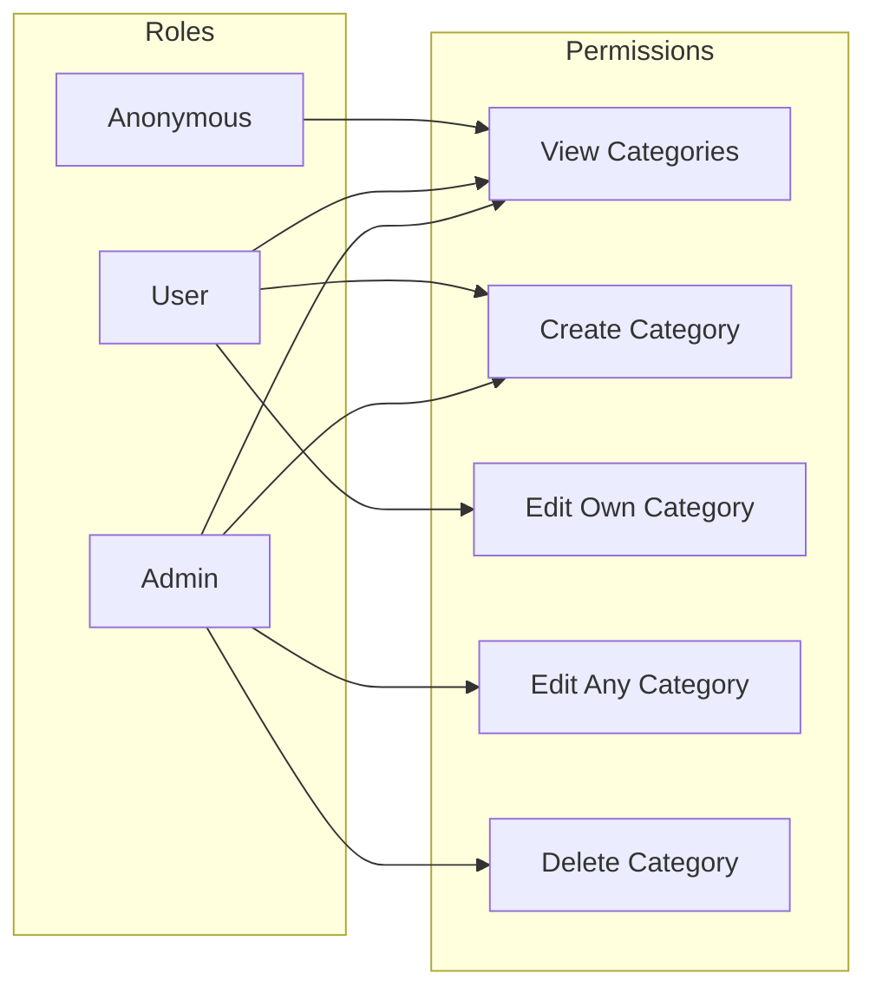
```mermaid
graph LR
    subgraph "Roles"
        A[Anonymous]
        B[User]
        C[Admin]
    end
    
    subgraph "Permissions"
        D[View Categories]
        E[Create Category]
        F[Edit Own Category]
        G[Edit Any Category]
        H[Delete Category]
    end
    
    A --> D
    B --> D
    B --> E
    B --> F
    C --> D
    C --> E
    C --> G
    C --> H
```

## Performance Optimization

### Caching Strategy

```mermaid
flowchart TD
    A[Request] --> B{Cache Hit?}
    B -->|Yes| C[Return Cached Data]
    B -->|No| D[Query Data Layer]
    D --> E[Process Data]
    E --> F[Store in Cache]
    F --> G[Return Data]
    C --> H[End]
    G --> H
    
    I[Cache Invalidation] --> J{Action Type?}
    J -->|Create| K[Clear Cache]
    J -->|Update| K
    J -->|Delete| K
    K --> L[Next Request Rebuilds Cache]
```

### Load Balancing Strategy

```mermaid
graph LR
    A[User Requests] --> B[Load Balancer]
    
    B -->|Round Robin| C[Server 1]
    B -->|Round Robin| D[Server 2]
    B -->|Round Robin| E[Server 3]
    
    C --> F[(Shared Cache)]
    D --> F
    E --> F
    
    C --> G[(Database)]
    D --> G
    E --> G
```

These diagrams provide a comprehensive visual representation of the Categories feature architecture, covering all aspects from high-level system design to detailed process flows and future enhancements.
